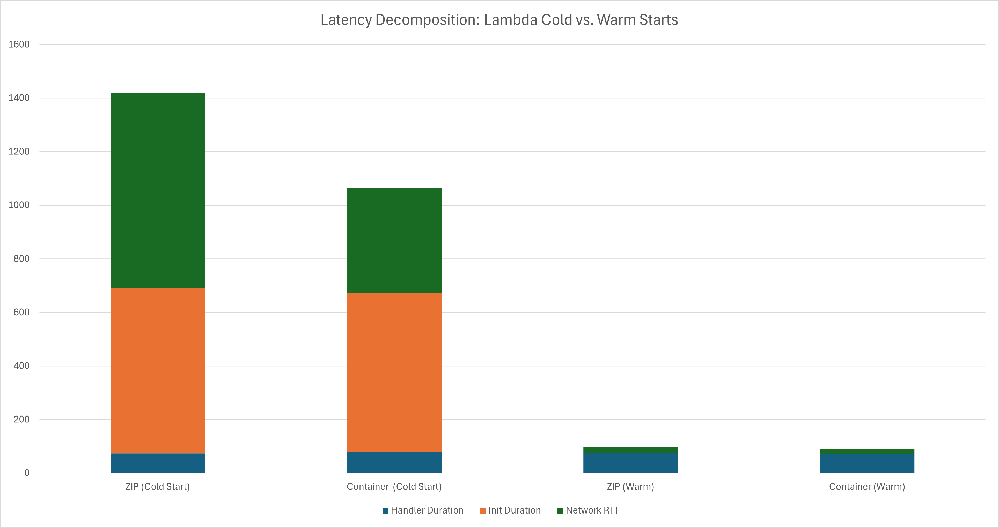
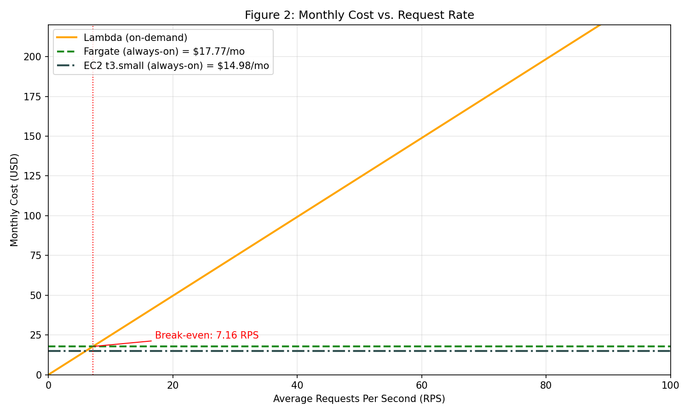

# AWS Cloud Performance Analysis Report

**Author:** Karolina Węgrzyn

**Date:** 2026-03-29

## Assignment 1: Deploy All Environments

The initial phase of the project involved the deployment of the k-NN search application across four distinct AWS execution environments: Lambda (ZIP), Lambda (Container), ECS Fargate, and an EC2 instance. Each environment was configured according to the provided manual to expose a functional HTTP endpoint.

### Functional Consistency

Following the deployment, a functional verification test was conducted to ensure that all four targets processed the same input data consistently. A standardized query vector was sent to each endpoint.

### Results and Deliverables

The verification confirmed that all execution environments are mathematically consistent. Each target returned identical k-NN results, proving that the application logic remains stable across serverless, containerized, and virtual machine-based infrastructure.

The successful terminal outputs, showing the matching JSON result arrays from all four endpoints, have been saved to the results/assignment-1-endpoints.txt file as required.

---

## Assignment 2: Scenario A — Cold Start Characterization

This scenario evaluates the "Cold Start" penalty of AWS Lambda by invoking the functions after at least 20 minutes of inactivity. This forces AWS to provision a new execution environment before running the application logic.

### Latency Decomposition

The following table breaks down the total client-side latency into its core components.

Formula used for Network RTT: `Network RTT = Total Client Latency - Init Duration - Handler Duration`

| Metric                  | Total Client Latency (ms) | Init Duration (ms) | Handler Duration (ms) | Estimated Network RTT (ms) |
| ----------------------- | ------------------------- | ------------------ | --------------------- | -------------------------- |
| Zip Cold Start          | 1419.70                   | 619.08             | 73.35                 | 727.27                     |
| Container Cold Start    | 1063.70                   | 593.24             | 80.16                 | 390.30                     |
| Zip Warm (Median)       | 98.10                     | 0.00               | 75.33                 | 22.77                      |
| Container Warm (Median) | 89.70                     | 0.00               | 70.75                 | 18.95                      |

### Analysis

**Impact of the Cold Start Penalty**

Cold starts drastically increase total latency. The `Init Duration` alone accounts for ~600 ms of the delay. Once the environment is warm, `Init Duration` drops to 0 ms, reducing total client latency by over 90% (e.g., from 1419.7 ms down to 98.1 ms for Zip).

**ZIP vs. Container Performance**

Despite Docker images typically being larger, the Container deployment initialized faster than the ZIP package (Init Duration: 593.24 ms vs. 619.08 ms). This resulted in a noticeably lower total cold start latency (1063.7 ms vs. 1419.7 ms), highlighting AWS's efficient backend caching for containerized Lambdas.

**Network RTT Inflation**

During a cold start, the Estimated Network RTT is heavily inflated (727.27 ms for Zip and 390.30 ms for Container) compared to warm starts (~19-23 ms). This indicates that AWS performs significant unlogged infrastructure provisioning before the official CloudWatch `Init Duration` metric even begins.

**Handler Consistency**

The actual execution time of the application `Handler Duration` remains highly stable across both deployment types and temperature states, ranging tightly between 70.75 ms and 80.16 ms. This confirms that the latency bottleneck during cold starts is strictly infrastructure-related, not application-bound.

## Assignment 3: Scenario B — Warm Steady-State Throughput

Measure per-request latency at sustained load across all four environments.

### Performance Comparison

The following table summarizes the performance of all environments during the warm steady-state test (500 requests total). The `Server avg (ms)` reflects the actual `query_time_ms` logged by the backend.

| Environment        | Concurrency | p50 (ms) | p95 (ms) | p99 (ms) | Server avg (ms) |
| ------------------ | ----------- | -------- | -------- | -------- | --------------- |
| Lambda (zip)       | 5           | 94.58    | 111.05   | 146.04   | 72.44           |
| Lambda (zip)       | 10          | 90.85    | 107.73   | 149.36   | 72.44           |
| Lambda (container) | 5           | 87.95    | 104.79   | 132.74   | 75.77           |
| Lambda (container) | 10          | 87.00    | 103.18   | 138.69   | 75.77           |
| Fargate            | 10          | 808.90   | 1085.60  | 1182.80  | 23.73           |
| Fargate            | 50          | 4101.50  | 4604.10  | 4777.40  | 23.73           |
| EC2                | 10          | 187.41   | 248.52   | 276.86   | 31.15           |
| EC2                | 50          | 863.10   | 1129.30  | 1297.80  | 31.15           |

_(There were no instances where p99 > 2× p95, indicating stable tail latency across all tests without major extreme outliers)._

### Analysis

**Scalability: Lambda vs. Fargate/EC2**

AWS Lambda's p50 latency remained perfectly stable (even slightly improving) when concurrency increased from $c=5$ to $c=10$ (e.g. Lambda zip dropped from ~94 ms to ~90 ms). This stability is due to Lambda's horizontal scaling model, where AWS provisions a dedicated, isolated execution environment for each concurrent request.

Conversely, Fargate and EC2 experienced massive latency degradation when scaling from $c=10$ to $c=50$. Fargate's p50 latency increased over 5x, and EC2s p50 increased nearly 4.6x. Because these environments use fixed, limited resources (a single container/instance), higher concurrency causes severe request queuing and CPU context switching overhead, slowing down all parallel operations.

**Client-side vs. Server-side Latency Discrepancy**

There is a significant gap between the client-measured p50 latency (e.g., ~90 ms for Lambda) and the server-side execution time `query_time_ms` (e.g., ~72 ms). For Fargate, the gap is massive (~808 ms vs. ~23 ms). This discrepancy is caused by several unmeasured network and infrastructure overheads:

- **Network RTT:** the physical transit time between the test-runner machine and the AWS target
- **HTTPS/TLS Overhead:** the time required to establish secure handshakes
- **AWS Routing:** time spent routing traffic through AWS API Gateways, Application Load Balancers (for Fargate), or internal Lambda service routers
- **Queuing Delays:** for Fargate and EC2, the client clock continues ticking while requests sit waiting in the server's incoming request queue before the application code even begins executing

## Assignment 4: Scenario C — Burst from Zero

Simulate a traffic spike arriving after a period of inactivity - simulating a 20-minute idle period to trigger cold starts.

### Burst Latency Results

The table below displays the latency distribution for each target under a sudden burst of 200 requests.

| Target             | Concurrency | p50 (ms) | p95 (ms) | p99 (ms) | Max (ms) | Cold Starts |
| ------------------ | ----------- | -------- | -------- | -------- | -------- | ----------- |
| Lambda (zip)       | 10          | 95.20    | 955.10   | 1052.40  | 1058.50  | 10          |
| Lambda (container) | 10          | 95.60    | 1173.10  | 1328.50  | 1430.00  | 10          |
| Fargate            | 50          | 908.70   | 1029.90  | 1064.10  | 1119.10  | 0           |
| EC2                | 50          | 4002.80  | 4294.80  | 4402.10  | 4404.20  | 0           |

_(Cells annotated in bold indicate extreme tail latency where p99 significantly impacts performance)._

### Analysis

**Lambda’s Burst p99 vs Fargate/EC2**
Lambda's p99 latency spikes drastically (e.g., 1052 ms for Zip and 1328 ms for Container) because the first wave of requests must wait for the entire serverless infrastructure to initialize (the "Cold Start" penalty) before executing the handler. In contrast, Fargate and EC2 are "always-on" provisioned services; they do not require spinning up new execution environments from scratch. Their p99 latencies (1064 ms and 4402 ms) are high purely due to request queuing and CPU throttling under the $c=50$ load, not infrastructure initialization.

**Identification of Bimodal Distribution in Lambda**
The results for Lambda clearly demonstrate a bimodal distribution:

- **The Warm Cluster (The Majority):** as seen in the histograms, approximately 190 requests were handled incredibly fast by the freshly initialized environments, clustering tightly around the p50 mark (~95 ms)
- **The Cold-Start Cluster (The Tail):** the initial 10 requests that triggered the cold starts formed a distinct second cluster at the tail end of the distribution, pushing the p95 and p99 values over 900-1300 ms

**SLO Assessment (p99 < 500ms)**
Under these burst conditions, AWS Lambda fails to meet the p99 < 500ms SLO. The latency penalty incurred during the infrastructure initialization phase pushes the 99th percentile well beyond the 500ms threshold for both the ZIP and Container deployments.

**Required Changes to Meet SLO:**
To guarantee a p99 < 500ms during sudden traffic spikes while remaining on Lambda, one must implement Provisioned Concurrency. This feature keeps a specified number of execution environments initialized and "warm" at all times, completely eliminating the cold start penalty, ensuring all requests are handled at the ~95 ms baseline.

## Assignment 5: Cost at Zero Load

| Environment                   | Hourly Idle Cost | Monthly Idle Cost (Full 24/7) | Monthly Idle Cost (18h/day idle) |
| :---------------------------- | :--------------- | :---------------------------- | :------------------------------- |
| **EC2 (t3.small)**            | $0.0208          | $14.98                        | $11.23                           |
| **Fargate (0.5 vCPU / 1 GB)** | $0.024685        | $17.77                        | $13.33                           |
| **Lambda**                    | **$0.00**        | **$0.00**                     | **$0.00**                        |

**Calculations:**

- **EC2:** $0.0208 _ 18 hours _ 30 days = $11.23
- **Fargate:** (0.5 vCPU _ $0.04048) + (1 GB _ $0.004445) = $0.024685 per hour. Total for 18h/day idle: $0.024685 _ 18 _ 30 = $13.33
- **Lambda:** 0 requests and 0 execution time results in $0 cost.

**Which environment has zero idle cost?**
**AWS Lambda** is the only environment with zero idle cost. This is because Lambda uses a serverless, "pay-as-you-go" pricing model. You are billed exclusively for the compute time consumed while the function is actively processing a request. During the 18 hours of daily inactivity, no underlying infrastructure is provisioned or kept running on your behalf, meaning the cost is exactly $0.00. EC2 and Fargate, on the other hand, are provisioned services that incur flat hourly charges as long as they are running, regardless of whether they are receiving traffic.

### Assignment 6: Cost Model, Break-Even, and Recommendation

**1. Computed Monthly Costs**
Using the provided traffic model for a 30-day month:

- Peak: 100 RPS × 1800 seconds × 30 days = 5,400,000 requests
- Normal: 5 RPS × 19,800 seconds × 30 days = 2,970,000 requests
- Total Monthly Requests: 8,370,000
- Average RPS: 8,370,000 / 2,592,000 seconds ~ 3.23 RPS

Lambda Monthly Cost Calculation (using measured p50 of 90.85ms / 0.09085s):

- Request Cost: 8,370,000 × $0.20 / 1,000,000 = $1.67
- Compute Cost: 8,370,000 × 0.09085s × 0.5 GB × $0.0000166667 = $6.34
- Total Lambda Cost: $8.01 / month

Always-On Costs (from Assignment 5):

- Fargate Total Cost: $17.77 / month
- EC2 Total Cost: $14.98 / month

**2. Break-Even Analysis**
The break-even point is where Lambda’s variable cost equals Fargate’s fixed monthly cost.

Let R be the average Requests Per Second (RPS). Let S be seconds per month (2,592,000).

Lambda Cost = R × S × (C_req + C_compute)

Where:
C_req = $0.0000002
C_compute = 0.09085s × 0.5GB × $0.0000166667 ≈ $0.0000007571

Total Lambda Cost = R × 2,592,000 × $0.0000009571 = R × $2.4808

Setting Lambda’s cost equal to Fargate’s fixed cost:
R × 2.4808 = 17.77
R = 17.77 / 2.4808 ≈ 7.16 RPS

Lambda becomes more expensive than Fargate only if the sustained average traffic exceeds 7.16 RPS.

**3. Final Recommendation**

**Recommended Environment:** AWS Lambda
Given the provided spiky traffic model (18 hours of absolute zero load, normal operation of 5 RPS, and short bursts of 100 RPS), AWS Lambda is the recommended execution environment.

**Justification with Measurements:**
At an average traffic volume of 3.23 RPS, Lambda is highly cost-effective, totaling only **$8.01/month**. This represents significant savings compared to always-on provisioned services like EC2 ($14.98/month) and Fargate ($17.77/month). The primary driver for these savings is the 18-hour daily idle period. During this time, Lambda incurs $0.00 in charges, whereas Fargate and EC2 continue to bill for unutilized capacity (provisioned waste). Lambda remains the cheapest option as long as the average traffic stays below the break-even point of 7.16 RPS.

**SLO Compliance & Required Changes:**
As currently deployed, **no environment successfully met the p99 < 500ms SLO during the 100 RPS burst.**

- During Scenario C (Burst from Zero), Lambda's p99 spiked to 1052.40 ms (for the ZIP deployment) because the initial wave of requests suffered from the ~600 ms Cold Start penalty (Init Duration).
- Fargate and EC2 also failed the burst SLO (p99 of 1064 ms and 4402 ms, respectively) due to severe CPU bottlenecking and request queuing under sudden load.

**Required Change:** To meet the 500ms SLO with Lambda, **Provisioned Concurrency** must be implemented. By pre-warming execution environments, we completely eliminate the Cold Start initialization penalty. As proven in Scenario B (Warm Steady-State), an initialized Lambda handles requests with a p99 of **149.36 ms**, comfortably satisfying the < 500ms SLO even under load.

**Decision Reversal Conditions:**
My recommendation would change from Lambda to an always-on service (like Fargate or EC2) under the following conditions:

1.  **Traffic Volume Escalation:** if the sustained average load permanently exceeds **7.16 RPS**, the fixed cost of Fargate ($17.77) becomes financially superior to Lambda's per-request billing.
2.  **Pattern Predictability:** if the traffic model shifts from "spiky and mostly idle" to a constant, predictable 24/7 stream, Lambda's zero-cost idle advantage disappears.
3.  **SLO Relaxation:** if the business relaxed the latency SLO to a p99 of 1500 ms, the baseline On-Demand Lambda would become viable out-of-the-box, removing the need for the architectural complexity of Provisioned Concurrency.
